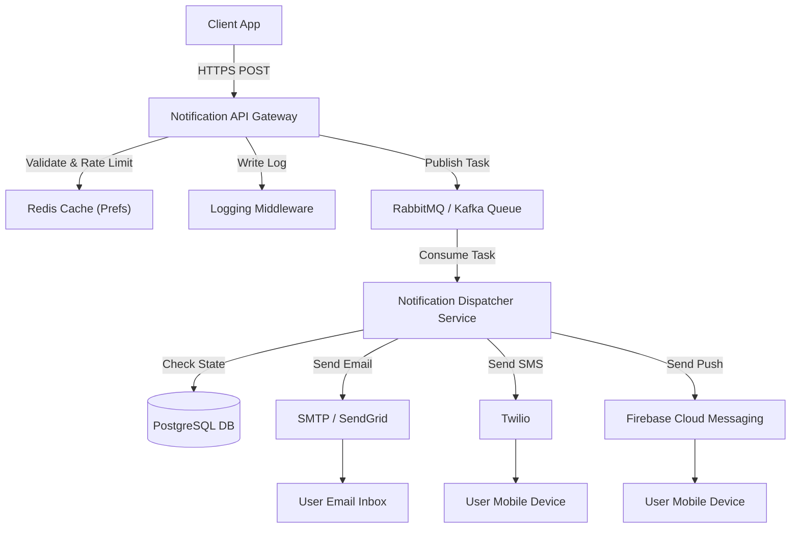

# Notification System Design Document

This document outlines the architecture, database schema, component design, and observability integrations for the scalable Notification System.

## Architecture Overview

The system uses an asynchronous, message-driven architecture to ensure high throughput, reliability, and low latency for dispatching notifications (Email, SMS, Push).



## System Components

### 1. Notification API Gateway
- **Responsibility**: Authenticates incoming client requests, validates payloads, performs rate limiting, checks user notification preferences, and publishes valid messages to the Message Queue.
- **Observability**: Uses `logging_middleware` to log request details at the `route` and `controller` levels.

### 2. Message Queue (Broker)
- **Responsibility**: Decouples the API Gateway from the slow delivery providers. Buffers peaks of traffic to prevent backend services from being overwhelmed.

### 3. Notification Dispatcher Service
- **Responsibility**: Consumes messages from the queue, handles retry logic (with exponential backoff), and forwards them to the appropriate external service provider (SendGrid, Twilio, FCM).
- **Observability**: Logs event lifecycles, warning status, and errors using the `service` and `cron_job` categories.

---

## Database Schema (PostgreSQL)

We utilize relational database tables to track user profiles, configurations, and message delivery statuses.

### Tables Description

| Table Name | Column Name | Data Type | Constraints | Description |
|---|---|---|---|---|
| **users** | `id` | `UUID` | `PRIMARY KEY` | Unique identifier for users |
| | `email` | `VARCHAR(255)` | `UNIQUE` | User email address |
| | `phone` | `VARCHAR(20)` | `UNIQUE` | User phone number |
| **preferences** | `id` | `UUID` | `PRIMARY KEY` | Preference ID |
| | `user_id` | `UUID` | `FOREIGN KEY` | Reference to `users.id` |
| | `email_enabled`| `BOOLEAN` | `DEFAULT TRUE` | Toggle for email notifications |
| | `sms_enabled` | `BOOLEAN` | `DEFAULT TRUE` | Toggle for SMS notifications |
| | `push_enabled`| `BOOLEAN` | `DEFAULT TRUE` | Toggle for push notifications |
| **notifications** | `id` | `UUID` | `PRIMARY KEY` | Unique notification ID |
| | `user_id` | `UUID` | `FOREIGN KEY` | Target user |
| | `type` | `VARCHAR(50)` | `CHECK(type IN ('email', 'sms', 'push'))` | Medium used |
| | `status` | `VARCHAR(50)` | `DEFAULT 'pending'` | `pending`, `sent`, `failed`, `retrying` |
| | `message` | `TEXT` | `NOT NULL` | Notification payload |
| | `created_at` | `TIMESTAMP` | `DEFAULT CURRENT_TIMESTAMP` | Log creation time |

---

## Observability and Logging Integration

> [!NOTE]
> The system integrates the custom `logging_middleware` package at key integration points. All logs are sent to the central evaluation endpoint for dashboarding and automated alerts.

### Logging Rules & Practices

1. **Database Failures**: Captured at the `db` package layer with `fatal` or `error` level.
2. **API Requests**: Logged at the `route` layer using `info` level.
3. **Queue Consumers**: Logged at the `cron_job` or `service` layer using `debug` level.
4. **Third-Party Failures**: Logged at the `service` layer using `warn` or `error` level.

### Example Logs Matrix
```javascript
// Database connection lost
Log("backend", "fatal", "db", "Database connection lost: connection timeout on 5432");

// Third-party API warning
Log("backend", "warn", "service", "Twilio API returned high latency (1200ms) for SMS dispatch");
```
